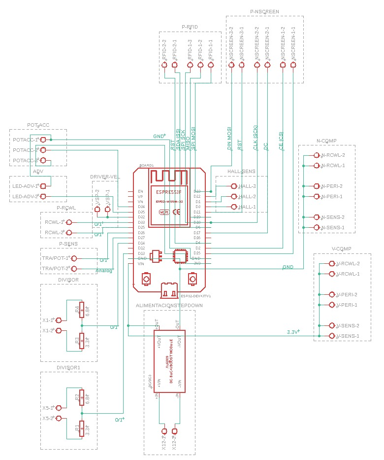
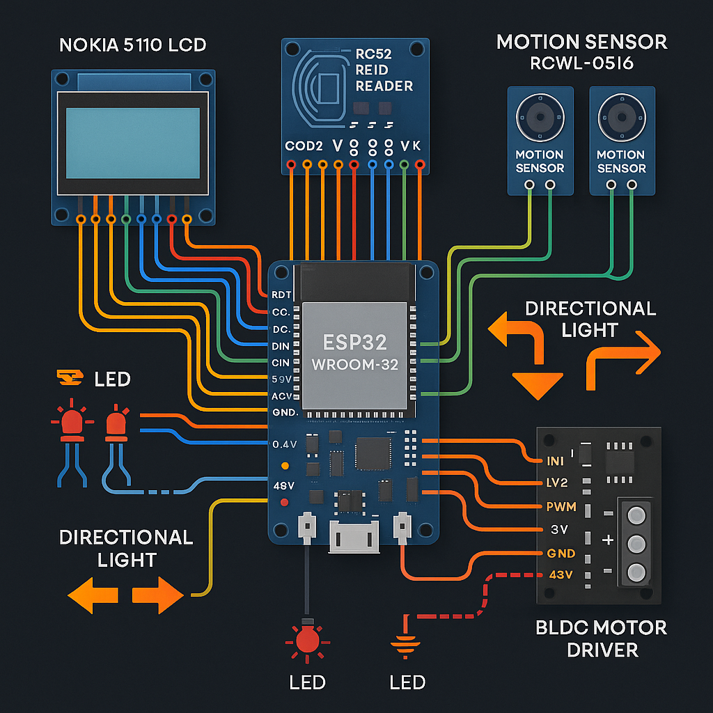
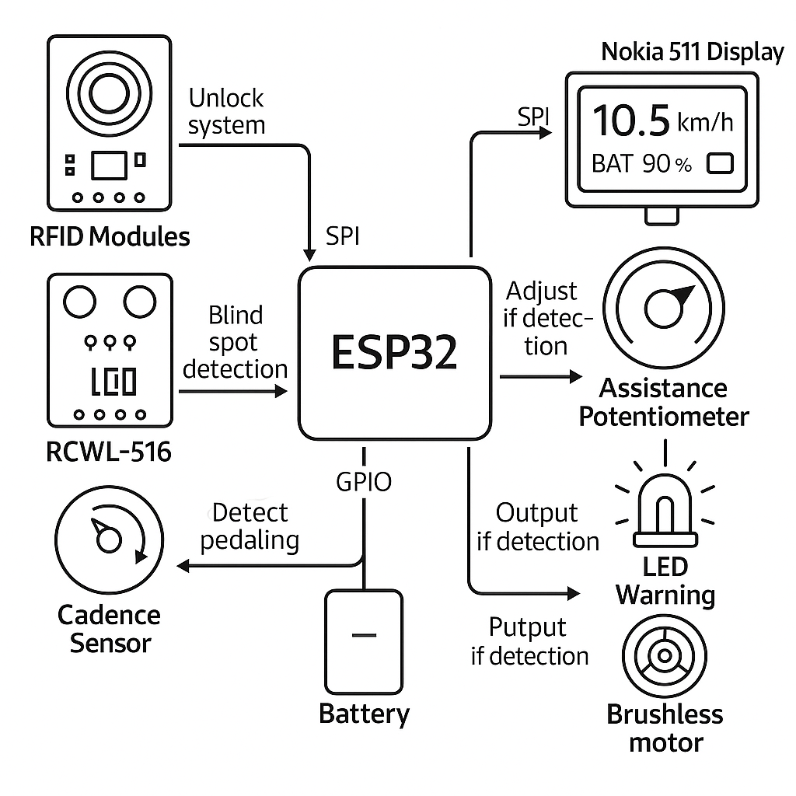

# Project: Assisted e-bike - ESP32

## Description

This project involves developing a electric bicycle using an ESP32 microcontroller, sensors, and a Nokia 5110 LCD screen.
The system is designed to display bicycle status information, motor assistance, and safety sensors such as blind spot detection and RFID.

---

## Technologies and tools

- ESP-IDF (Official Espressif framework for ESP32).
- C Programming language.
- Git and GitHub.
- FreeRTOS (Real-time task management).
- SPI Master driver (for Nokia 5110 screen control).

---

## Electronic components

- ESP32-WROOM-32
- Nokia 5110 LCD screen
- SNR8503M driver for BLDC motor
- RCWL-0516 sensors (blind spot detection)
- RFID-RC522 module
- BLDC motor

---

## Features

- BLDC motor control with SNR8503M driver.
- Blind spot detection using RCWL-0516 sensors.
- Visual interface on Nokia 5110 display.
- Low-level control using ESP-IDF in C.
- Access detection to the system with RFID-RC522 lector

---

## Project Documentation  

The detailed documentation is located in the [`docs/`](./docs/) folder:  

| File                      | Description |
|---------------------------|-------------|
| [`architecture.md`](./docs/architecture.md)        | General architecture of the assistance system. |
| [`components.md`](./docs/components.md)            | Electronic components used. |
| [`gpio_map.md`](./docs/gpio_map.md)                | GPIO pin mapping between modules and the ESP32. |
| [`power_distribution.md`](./docs/power_distribution.md) | Power distribution from the 36V battery to various modules. |
| [`software_flow.md`](./docs/software_flow.md)      | Software logic flow (state and events). |
| [`roadmap.md`](./docs/roadmap.md)                  | Development roadmap for software and hardware. |
| [`changelog.md`](./docs/changelog.md)              | Version change log. |

---

## Diagrams

Located in the [`hardware/`](./hardware/) directory:

| Diagram                                 | Description                        |
|-----------------------------------------|------------------------------------|
|  | Logical schematic of the circuit   	  |
|        | Wiring diagram for physical setup  	  |
|       | System overview of the logic behavior  |

---

## GPIO connections – ESP32-WROOM-32

| Component              | Description                        | ESP32 pin (GPIO) | Notes                                  |
|------------------------|------------------------------------|------------------|----------------------------------------|
| 📟 Nokia 5110 display  | LCD SPI display                    | GPIO 18 (CLK)    | SPI clock, share with RFID             |
|                        |                                    | GPIO 23 (DIN)    | Data in (MOSI), shared with RFID       |
|                        |                                    | GPIO 2 (CE)      | Chip enable (unique per device)        |
|                        |                                    | GPIO 17 (DC)     | Data/Command select                    |
|                        |                                    | GPIO 21 (RST)    | Reset pin                              |
| 🧿 RFID RC522          | RFID reader SPI                    | GPIO 18 (SCK)    | Share SPI clock (OK)                   |
|                        |                                    | GPIO 23 (MOSI)   | Share SPI MOSI (OK)                    |
|                        |                                    | GPIO 19 (MISO)   | Required for SPI communication         |
|                        |                                    | GPIO 5 (SDA/SS)  | SPI Slave select (unique per device)   |
|			 |				      | GPIO 4 (RST)	 | Module reset				  |
| 📡 RCWL-0516 (1)       | Blind spot sensor (right)          | GPIO 33          | Digital output                         |
| 📡 RCWL-0516 (2)       | Blind spot sensor (left)           | GPIO 32          | Digital output                         |
| 💡 Blind spot LED      | Warning light for blind spots      | GPIO 16          | Controlled via software (HIGH/LOW)     |
| ⚙️  BLDC driver         | PWM signal input (VSP)             | GPIO 25          | Control signal to driver               |
| 🧲 Trigger 		 | Accelerator trigger (analog)	      | GPIO 34		 | ADC input to read trigger position     |
| 🎛️ Potentiometer	 | Assistance level control (analog)  | GPIO 26		 | ADC input to set motor assist level    |
| 🧭 Hall sensors (motor)| Measure wheel/motor rotation speed | GPIO 3		 | Hall sensor 1			  |
|                        |                                    | GPIO 1           | Hall sensor 2                          |
|                        |                                    | GPIO 22          | Hall sensor 3                          |
| 🦶 Hall sensor (pedal) | Detects pedal movement (engine ON) | GPIO 27		 | Interrupt-based activation             |
| 🔁 Turn signal (right) | Right directional indicator        | GPIO 14          | HIGH to activate right sensor	  |
| 🔁 Turn signal (left)  | Left directional indicator         | GPIO 13          | HIGH to activate left sensor		  |

---

## Project structure

```text
assisted_ebike_project/
├── docs/                       # Project documentation in Markdown
│   ├── architecture.md
│   ├── components.md
│   └── ...
├── firmware/
│   ├── main/             	# Main ESP32 application source code
│   │   ├── main.c
│   │   └── CMakeLists.txt
│   ├── managed_components/           	# Libraries of required components
│   │   └── abobija__rc522/
│   └── CMakeLists.txt
├── hardware/                  	# Hardware diagrams and schematics
│   ├── schematic_diagram.png
│   └── wiring_diagram.png
├── test/                      	# Unit or integration testing files
├── .gitignore
├── LICENSE
└── README.md
```

---

## How to compile and upload

1. **Set up the ESP-IDF environment** (see [ESP-IDF Getting Started Guide](https://docs.espressif.com/projects/esp-idf/en/latest/)).

2. **Clone the repository**:

```bash
git clone https://github.com/AJTech759726/assisted_ebike.git
```

3. **Navigate to the firmware directory**:

```bash
cd assisted_ebike/firmware/
```

4. *(Optional)* **Set ESP32 as the target**:

```bash
idf.py set-target esp32
```

5. **Build the firmware**:

```bash
idf.py build
```

6. **Flash to ESP32** (replace ```<your_port>``` with your actual port, e.g., ```/dev/ttyUSB0``` or ```COM3```):

```bash
idf.py -p <your_port> flash
```

7. **Monitor output**:

```bash
idf.py monitor
```

You can combine flashing and monitoring in one command:

```bash
idf.py -p <your_port> flash monitor
```

Press ```Ctrl+]``` to exit monitor mode.

---

## Project status

- [x] 📦 Basic ESP32 connection
- [x] 📘 Display text on Nokia 5110 screen
- [x] 📐 Integrate RCWL-0516 blind spot sensors
- [x] 📐 Read data from RFID RC522 reader
- [x] 💡 Control rear blind spot sensors with the turn signals
- [x] 🔁 Control turn signals (two wires)
- [x] ⚙️  Connect and test the BLDC driver
- [x] 🧠 Develop assistance logic
- [x] 🛠️ Integrate all modules into the system
- [x] 🧪 Perform integration tests on the bicycle
- [x] 📦 Document all physical connections
- [x] 📝 Add connection diagram to README

---

**Legend**:

```
🛠️: Technical implementation
📐: Sensors
💡: Actuators
📘: Communication
📦: Hardware
```

---

## Author

- Developed by **Alan Joshua Jiménez Flores**

- [GitHub Profile](https://github.com/AJTech759726/)

---

Developed with [ESP-IDF](https://docs.espressif.com/projects/esp-idf/en/latest/).
